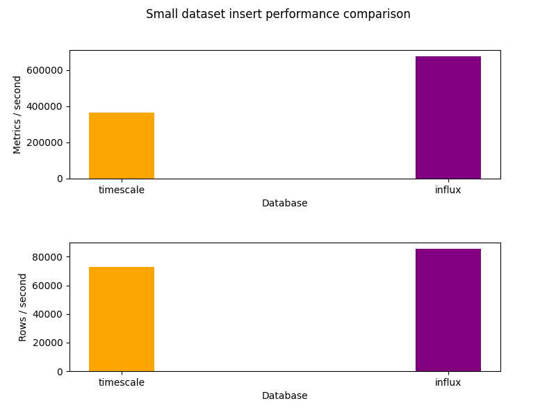
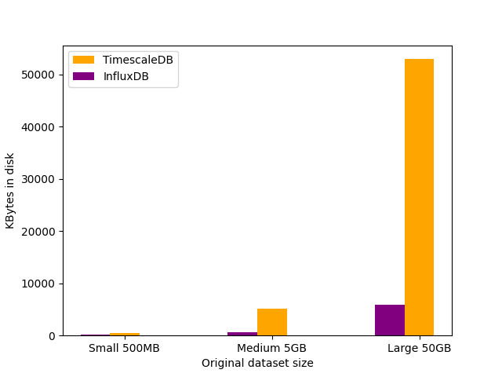
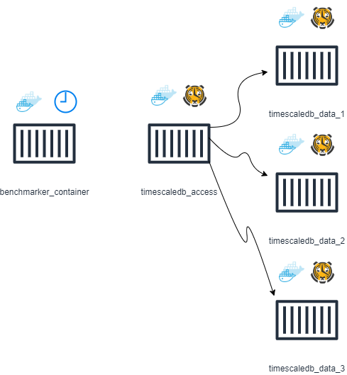
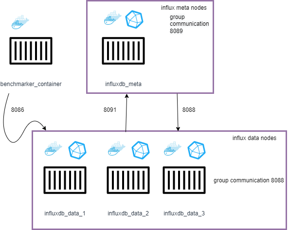

# Time-Series-Databases-Benchmarks

Performance comparison of Time-Series-Databases specifically influxDB and timescaleDB.
This work was done as a semester project for the course of Analysis and Design of big
data information systems. It consists of a series of scripts and documentation to install
and benchmark some popular Time-Series Databases on debian based operating systems.

# Overview
[Installation and prerequisites](#install-telegraf-(1.20.4))
<br>
[Dataset Generation](#data-generation)


## Install InfluxDB (v1.8.10)
```console
foo@bar:~$ wget -qO- https://repos.influxdata.com/influxdb.key | gpg --dearmor > /etc/apt/trusted.gpg.d/influxdb.gpg
foo@bar:~$ export DISTRIB_ID=$(lsb_release -si); export DISTRIB_CODENAME=$(lsb_release -sc)
foo@bar:~$ echo "deb [signed-by=/etc/apt/trusted.gpg.d/influxdb.gpg] https://repos.influxdata.com/${DISTRIB_ID,,} ${DISTRIB_CODENAME} stable" > /etc/apt/sources.list.d/influxdb.list
foo@bar:~$ sudo apt-get update && sudo apt-get install influxdb
foo@bar:~$ sudo service influxdb start

```

## Install Telegraf (1.20.4)
```console
foo@bar:~$ wget https://dl.influxdata.com/telegraf/releases/telegraf_1.20.4-1_amd64.deb
foo@bar:~$ sudo su
root@bar:/home/foo/# export RUNLEVEL=1
root@bar:# dpkg -i telegraf_1.20.4-1_amd64.deb
root@bar:# rm telegraf_1.20.4-1_amd64.deb
```

## Install PostgresSQL Database (v12)
```console
foo@bar:~$ sudo apt-get install postgresql postgresql-contrib -y
```
Verify that the postgres service is running successfully
```console 
foo@bar:~$ pg_lsclusters
Ver Cluster Port Status Owner    Data directory              Log file
12  main    5432 online postgres /var/lib/postgresql/12/main /var/log/postgresql/postgresql-12-main.log
foo@bar:~$ sudo -i -u postgres
```
Enter your password for the Postgres user 
```console 
postgres@bar:~$ psql -c "alter user postgres with password 'password'"
```
Then exit from the postgres user
```console 
postgres@bar:~$ exit
logout
foo@bar:~$ 
```

## Install TimescaleDB (v12)
```console 
foo@bar:~$ sudo apt-get install gnupg2 software-properties-common curl git unzip -y
foo@bar:~$ sudo add-apt-repository ppa:timescale/timescaledb-ppa -y
foo@bar:~$ sudo apt-get install timescaledb-postgresql-12 -y
foo@bar:~$ sudo timescaledb-tune --quiet --yes
foo@bar:~$ sudo service postgresql restart
foo@bar:~$ sudo -i -u postgres
postgres@bar:~$ psql -c "CREATE EXTENSION IF NOT EXISTS timescaledb;"
postgres@bar:~$ exit
```


## Install Golang (2.1.13)
```console 
foo@bar:~$ sudo apt install golang-go
```

## Build TSBS Go Programs

```console 
foo@bar:~$ cd tsbs
foo@bar:~/tsbs$ make
...

```
# Data Generation


## Data generation synopsis
Our goal here is to generate three datasets of pseudo-csv data for influxDB and timescaleDB that differ orders of magnitude. For that purpose we will use the time series benchmark suite that has prebuilt tools forgeneration of pseudo-random data as well as benchmarking scripts that measure read and write performance .

<b>Small Dataset</b> ≈ 500MB
<b>Medium Dataset</b> ≈ 5GB
<b>Large Dataset</b> ≈ 50GB


## Parameter selection for generating the different file sizes

The default example given by tsbs to generate a dataset of three days of measurements for 
approximately 4000 trucks that send data every 10 seconds during their working hours is
named tsbs_generate_data and it is located inside the bin folder of tsbs. We execute the
script as
```console 
foo@bar:~$
time tsbs_generate_data --use-case="iot" --seed=123 --scale=4000 \
    --timestamp-start="2016-01-01T00:00:00Z" \
    --timestamp-end="2016-01-01T10:00:00Z" \
    --interleaved-generation-groups=10 \
    --log-interval="10s" --format="timescaledb" > ~/iot_data/timescale-data-small.csv
```
The generated file size is approximately 490ΜΒ (as expected for the small dataset), which means that with the above scale and log-interval as fixed parameters we could generate the other datasets by multiplying the time window one order of magnitude each time. The data-generation commands are located at Time-Series-Databases-Benchmarks/generation/data as shell scripts and the output of each command is stored by default at /home/user/iot_data. The --interleaved-generation-groups=10 parameter is used to speed up the data-generation process. Values above 10 do not seem to make a difference but that might be dependant on the underlying hardware. The results are show below
```console 
foo@bar:~$ ls -lh ~/iot_data
total 119G
-rw-rw-r-- 1 kimonas kimonas  59G Δεκ  17 19:54 influx-data-large.csv
-rw-rw-r-- 1 kimonas kimonas 5,7G Δεκ  17 13:57 influx-data-medium.csv
-rw-rw-r-- 1 kimonas kimonas 593M Δεκ  16 23:21 influx-data-small.csv
-rw-rw-r-- 1 kimonas kimonas  49G Δεκ  17 17:19 timescale-data-large.csv
-rw-rw-r-- 1 kimonas kimonas 4,8G Δεκ  17 12:20 timescale-data-medium.csv
-rw-rw-r-- 1 kimonas kimonas 483M Δεκ  16 23:11 timescale-data-small.csv
```
The consistent difference between influx and timescaledb format filesizes is not something to be considered unusal and thats because the influx version uses key-value pairs for every row of data thus allowing semi-structured data whereas postgres as a strict relational database uses a csv tabular format

# Insert/Write Performance

## Synopsis

To measure insert performance we use the scripts load_timescaledb.sh and load_influx.sh for each database accordingly. These scripts are based on the load_timescaledb and load_influx go executables.They automate the insert performance benchmarking and allow for some parametrization. The scripts were run with workers=2 , batch_size =10000 and the default parameters for each database changing only the database_name param so that inserts wont interfere with previous ones. We redirect the write performance results to files located inside peformance/write. Before running the scripts you should change the files /scripts/load/load_timescaledb.sh and /scripts/load/load_common.sh .A thing that should definetely be changed is the bulk_data_dir to point ot the data directory (load_common.sh) .
<br>
## Example for the small dataset
This is the TimescaleDB version using the small dataset and the default parameters with  num_workers = cpu_cores and batch_size=10000

```console 
foo@bar:~$ scripts/load/load_timescaledb.sh | tee ../performance/write/timescale_small.out
Bulk loading file /home/kimonas/iot_data/timescale-data-small.csv
+ pg_isready -h localhost -p 5433
localhost:5433 - accepting connections
+ cat /home/kimonas/iot_data/timescale-data-small.csv
+ /home/kimonas/Time-Series-Databases-Benchmarks/tsbs/bin/tsbs_load_timescaledb --postgres=sslmode=disable --db-name=benchmark_small --host=localhost --port=5433 --pass=pass --user=postgres --workers=4 --batch-size=10000 --reporting-period=10s --use-hypertable=true --use-jsonb-tags=false --in-table-partition-tag=true --hash-workers=false --time-partition-index=false --partitions=0 --chunk-time=8h --write-profile= --field-index-count=1 --do-create-db=true --force-text-format=false
time,per. metric/s,metric total,overall metric/s,per. row/s,row total,overall row/s
1640252525,454936.28,4.550016E+06,454936.28,90986.94,9.100000E+05,90986.94
1640252535,360012.58,8.149768E+06,407480.30,72007.48,1.630000E+06,81498.38
1640252545,309956.29,1.125002E+07,374967.91,61986.22,2.250000E+06,74993.45
Summary:
loaded 12965262 metrics in 35.669sec with 4 workers (mean rate 363483.77 metrics/sec)
loaded 2593066 rows in 35.669sec with 4 workers (mean rate 72697.13 rows/sec)
```
This is the InfluxDB version using the small dataset and the default parameters with  num_workers = cpu_cores and batch_size=10000

```console 
foo@bar:~$ touch influx_small.out ; scripts/load/load_influx.sh | tee ../performance/write/influx_small.out
Bulk loading file /home/kimonas/iot_data/influx-data-small.csv
{"results":[{"statement_id":0}]}
time,per. metric/s,metric total,overall metric/s,per. row/s,row total,overall row/s
1640282922,632561.89,6.325782E+06,632561.89,79997.94,8.000000E+05,79997.94
1640282932,672135.10,1.304704E+07,652348.09,85001.21,1.650000E+06,82499.52
1640282942,703736.23,2.008442E+07,669477.43,88999.79,2.540000E+06,84666.27
[worker 2] backoffs took a total of 0.000000sec of runtime
[worker 0] backoffs took a total of 0.000000sec of runtime
[worker 1] backoffs took a total of 0.000000sec of runtime
[worker 3] backoffs took a total of 0.000000sec of runtime

Summary:
loaded 20503558 metrics in 30.308sec with 4 workers (mean rate 676499.27 metrics/sec)
loaded 2593066 rows in 30.308sec with 4 workers (mean rate 85556.24 rows/sec)
```
## Parsing the results and plotting with matplotlib

We use the python script graph_write_performance.py to extract the two metrics that are relevant to compare insert performance . These are the metrics/sec and rows/sec and they are found at the last two lines of the benchmark output. We first download the required dependencies and then call the script
```console
foo@bar:~/Time-Series-Databases-Benchmarks/scripts$ pip install -r requirements.txt
foo@bar:~/Time-Series-Databases-Benchmarks/scripts$ cd ..
foo@bar:~/Time-Series-Databases-Benchmarks$ python3 scripts/graph_write_performance.py 
```
And we receive three sets of graphs for each dataset

Small Dataset example




## Database size on disk comparison

To locate the database on disk we need to install an interactive disk usage analyzer. For that we choose ncdu

```console
foo@bar:~/$ sudo su
root@bar:/# apt-get install ncdu
root@bar:/# cd /var/lib/postgresql/12/main/base
root@bar:/var/lib/postgresql/12/main/base# ncdu
ncdu 1.15.1 ~ Use the arrow keys to navigate, press ? for help
--- /var/lib/postgresql/12/main/base -----------------------------------------
   50,5 GiB [##########] /34250
    4,8 GiB [          ] /18346
  508,3 MiB [          ] /17659
    9,0 MiB [          ] /13496
    7,8 MiB [          ] /1
    7,7 MiB [          ] /13495
    4,0 KiB [          ] /pgsql_tmp 
```
And the path for influxdb is /var/lib/influxdb/data/ accordingly
<br>
## Parsing the results and plotting with matplotlib
To measure and graph disk size per database and dataset size([influx/timescale]{small ,medium ,large}) open the python script contained in scripts/graph_size_on_disk.py and change two things
```python
sudo_password = 'change_to_your_sudo_password'
```
and the dictionary values below to match the database name given by postgres for each dataset size. Postgres makes our life difficult by naming databases numerically in the data storage folder
```python
timescaledb_database_dictionary = { 'small' : '17659', 'medium' : '18346', 'large' : '34250' }
```
Running the script for the results we generated gives the graph below
<br>


It is obvious seeing the graph that influxDB performs efficient time-series specific compression algorithms whereas timescaleDB does not compress the data. TimescaleDB databases in disk are within the order of magnitude of the original csv input data where as influx db disk-data are compressed almost to one-tenth of the original set.  

## Generating queries using TSBS

To benchmark the two databases we have chosen to generate two distinct scenarios for each database/size.

1) A set of single iot queries that cover all of the query spectrum from aggregates and joins to heavy mathematical computation.

2) A set of 10 times repeatable queries that also cover all of the query spectrum and are meant to be executed one after another

For that purpose we will use the bash scripts [generate_query_1.sh](./generation/query/generate_query_1.sh) and [generate_queries_10.sh](./generation/query/generate_queries_10.sh)
that generate the N queries accordingly and place them inside folders respectably

Be careful to match the time-ranges in the data generated and loaded into each database with the time-ranges in the queries
To run the script simply do from the root of the repo:
```console 
foo@bar:~$ sudo chmod +x ./generation/query/generate_query_1.sh
foo@bar:~$ ./generation/query/generate_query_1.sh 
```
Queries are inside the folder generation/query/<b>scenario</b>/<b>database</b>/<b>size</b>

## Measuring performance on a single machine

To measure perforamce on a single machine we used the script [run_queries.sh](./scripts/run_queries.sh) that is more or less a merge of the run_queries_timescaledb and run_queries_influx.sh provided by the benchmark suite. We should note that these scripts parameterize the go binaries using environment variables. Before running the script you should check that the host, port , database name , and password parameters are set correctly and according to your database login credentials. If testing locally you should prefer passwordless authentication for both postgres (timescale) and influxdb

From now on we also avoid manual parsing of the outfile and we use the --results-file parameter that outputs the results into a well formed JSON file. We also decided to run the queries twice using the --prewarm-queries flag to evaluate the caching performed by the two databases.

Parameterize the run_queries script by using the source code or by setting the environment variables at runtime and run:
```console 
foo@bar:~$ sudo chmod +x ./scripts/run_queries.sh
foo@bar:~$ sudo ./scripts/run_queries.sh
[sudo] password for foo:
```
The script needs root access in order to stop postgres or influx depending on the benchmark, clear the operating system's cache and proceed to restart the service before executing the next query

We ran all of the tests successfully and gathered some interesting results while comparing the two systems. The results can be found at the [performance/query](./performance/query) directory archived by scenario , database and size , the same as the generated queries

## Measuring performance on multi-node environment

To measure performance on a multi-node environment we used publicly available docker images in combination with the Dockerfile given by TSBS. We ve conducted benchmarks for 1 access node ( or meta node ) and 1 ,3 and 5 data
nodes for multi-node postgres ( timescaledb ) and influxdb. 

## Timescaledb multi-node architecture


The image describes a docker network of containers called time_series_network:
<br>
<b>benchmarker_container</b> is a modified version of the TSBS Dockerfile
Change
```dockerfile
FROM alpine:3.8.5
```
to 
```dockerfile
FROM timescale/timescaledb:latest-pg12
```
and add the line
```dockerfile
ENV PATH "$PATH:/"
```
in order to run the go binaries from everywhere inside the containers file system. To build the image do:
```powershell
docker build -t benchmarker .
```
and
```powershell
docker build -t benchmarker .
```
and 
```bash
 docker run --name benchmarker_container --network=time_series_network \
    --mount type=bind,source=~/iot_data,target=/opt/iot_data \
    --mount type=bind,source=~/Time-Series-Databases-Benchmarks/cluster_performance,target=/opt/cluster_performance \
    --mount type=bind,source=~/Time-Series-Databases-Benchmarks/tsbs/scripts/,target=/opt/scripts \
    --mount type=bind,source=~/Time-Series-Databases-Benchmarks/generation/query/,target=/opt/generation/query \
    -dt benchmarker
```
to run the benchmark container assign it to the time_series_network and mount some host directories to the container as a bind mount drive to easily input the data and queries and output the results
<br>
<b>timescale_access</b> 
```bash
docker run -dt --name timescaledb_access --network=time_series_network -p 5432:5432 -e POSTGRES_HOST_AUTH_METHOD=trust timescale/timescaledb:latest-pg12
```
<b>timescale_data 1 to 5</b> 
```bash
docker run -dt --name timescaledb_data_1 --network=time_series_network -p 5433:5432 -e POSTGRES_HOST_AUTH_METHOD=trust timescale/timescaledb:latest-pg12
docker run -dt --name timescaledb_data_2 --network=time_series_network -p 5434:5432 -e POSTGRES_HOST_AUTH_METHOD=trust timescale/timescaledb:latest-pg12
docker run -dt --name timescaledb_data_3 --network=time_series_network -p 5435:5432 -e POSTGRES_HOST_AUTH_METHOD=trust timescale/timescaledb:latest-pg12
docker run -dt --name timescaledb_data_4 --network=time_series_network -p 5436:5432 -e POSTGRES_HOST_AUTH_METHOD=trust timescale/timescaledb:latest-pg12
docker run -dt --name timescaledb_data_5 --network=time_series_network -p 5437:5432 -e POSTGRES_HOST_AUTH_METHOD=trust timescale/timescaledb:latest-pg12
```
While setting up you should ensure that the appropriate left hand side ports of the -p parameter are open on the host

## Configuring the timescaledb nodes

To configure the access and data nodes accordingly you have to open a bash session inside the containers. If you use docker desktop this is done easily via pressing the cli button on the container. If you do not have access to the docker desktop gui type the following command
```bash
docker exec -it <container-name-or-id> bash
```
On the access node you should open postgresql.conf and change the following configurations
``` 
enable_partitionwise_aggregate=on
jit=off
```
On the data node you should open postgresql.conf and change the following configurations
``` 
max_prepared_transactions=150
wal_level=logical
```
After configuration you should always restart the containers and not issue a pg_ctl reload command. By setting the enviroment variable POSTGRES_HOST_AUTH_METHOD to trust at container startup we can proceed to connect the nodes to a cluster using the minimum amount of configuration. For your ease you should install a postgresql client such as pgAdmin, Datagrip or DBeaver and connect to the access node's postgresql server. Also you should create every database before inserting data ( do not rely on the --do-create-db parameter while working with distributed databases ) and after that point the data nodes to the access node using their internal container-ip-addresses using:
```SQL
SELECT add_data_node('dn1', '192.168.0.4')
SELECT add_data_node('dn2', '192.168.0.5')
SELECT add_data_node('dn3', '192.168.0.6')
```
and 
```SQL
SELECT * FROM timescaledb_information.data_nodes;
```
to confirm that every data node has been added successfully. 

## Running insert and query performance benchmarks on multi-node timescaledb 

After configuration you are ready to measure insert performance using the [load_timescaledb.sh](./tsbs/scripts/load/load_timescaledb.sh) script inside the container but changing the parameters:
```bash
 REPLICATION_FACTOR=0
 IN_TABLE_PARTITION_TAG=false
```
to 
```bash
 REPLICATION_FACTOR=1
 IN_TABLE_PARTITION_TAG=true
```
in order to inform the suite to create the tables as distributed hypertables. To run the queries and record results use the [run_queries_multi.sh](./cluster_performance/run_queries_multi.sh) script inside the benchmarker_container after parameterizing correctly as
```console
/ # /opt/cluster_performance/run_queries_multi.sh
```
See more details inside the script
## Influxdb multi-node architecture


The influx cluster follows the RAFT protocol and allows for group communication between meta and data nodes while also providing prebuilt images on their docker hub repository for meta as well as data nodes.Cluster is a premium feature of influxdb and influx offers a free 14 day trial.

To pull the images and spin up the containers do the following:
```bash
docker run -dt --name influxdb_meta --network=time_series_network -e INFLUXDB_ENTERPRISE_LICENSE_KEY=<your_license_key> -p 8086:8086 influxdb:1.8.10-meta-alpine
docker run -dt --name influxdb_data_1 --network=time_series_network -e INFLUXDB_ENTERPRISE_LICENSE_KEY=<your_license_key> -p 8087:8086 influxdb:1.8.10-data-alpine
docker run -dt --name influxdb_data_2 --network=time_series_network -e INFLUXDB_ENTERPRISE_LICENSE_KEY=<your_license_key> -p 8088:8086 influxdb:1.8.10-data-alpine
docker run -dt --name influxdb_data_3 --network=time_series_network -e INFLUXDB_ENTERPRISE_LICENSE_KEY=<your_license_key> -p 8089:8086 influxdb:1.8.10-data-alpine
docker run -dt --name influxdb_data_4 --network=time_series_network -e INFLUXDB_ENTERPRISE_LICENSE_KEY=<your_license_key> -p 8090:8086 influxdb:1.8.10-data-alpine
docker run -dt --name influxdb_data_5 --network=time_series_network -e INFLUXDB_ENTERPRISE_LICENSE_KEY=<your_license_key> -p 8091:8086 influxdb:1.8.10-data-alpine
```

To configure the cluster connect to the meta node and type the following:
```console
/# influxd-ctl add-meta 5a8dbd27b87a:8091
``` 
where 5a8dbd27b87a are the first 12 letters of the docker container id of the meta node (You can also try local network ip's and dns resolvable names) and 8091 is the port data nodes use to communicate with the meta nodes ( in this case we only have one )
<br>
Then also inside the meta-node do the following: 
```console
/# influxd-ctl add-data d5938b8b64d3:8088
/# influxd-ctl show

``` 
where d5938b8b64d3 are the first 12 letters of the docker container id of the data node and 8088 is the port meta nodes use to communicate with the data nodes. The influxd-ctl show command is used to validate that the cluster was configured correctly and returns something like this for 1 meta and 1 data node
```console
Data Nodes
==========
ID      TCP Address             Version
2       d5938b8b6b52:8088       1.8.10-c1.8.10

Meta Nodes
==========
TCP Address             Version
5a8dbd27b87a:8091       1.8.10-c1.8.10
```

To benchmark insert performance we use the script [load_influx.sh](./tsbs/scripts/load/load_influx.sh) using one of the data node's port 8086. To benchmark write performance we use the same script as with timescaledb ([run_queries_multi.sh](./cluster_performance/run_queries_multi.sh)) but changing the database to influx, and parameterizing correctly 


